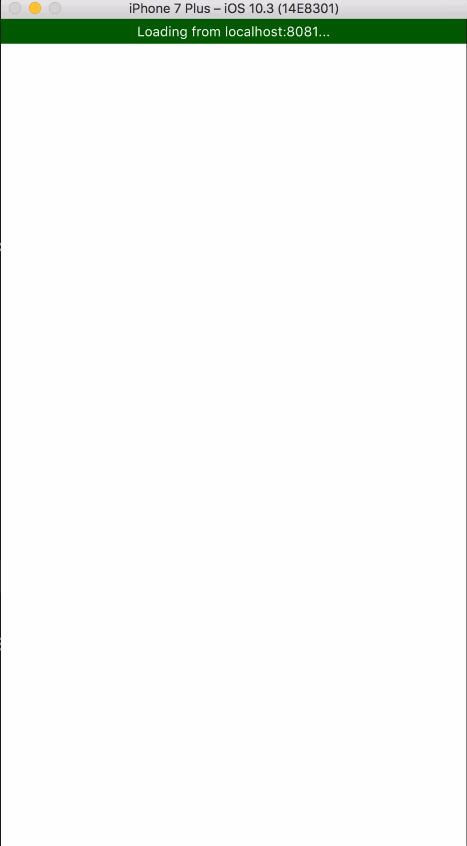

# Responsive React Native Animated Bar

## Install

```
npm install react-native-animated-bar --save

yarn add react-native-animated-bar
```

## Live Demo

[https://snack.expo.io/Hk03E4Avb](https://snack.expo.io/Hk03E4Avb)

## Configuration Options

* `height` - Configure the height. Default: `10`. AutoSize height of bar set to null (`height={null}`)
* `borderColor` - Configures the border color. Default: `#000`.
* `borderWidth` - Configures the width of the border. Default: `1`.
* `borderRadius` - Configures border radius. Default: `0`.
* `barColor` - Configures the color of the progress bar. Default: `#FFF`.
* `fillColor` - Configures color behind progress bar. Default: `rgba(0,0,0,.5)`.
* `duration` - Configures length of time in milliseconds the change in progress should take. Default: `100`.
* `animate` - Configures whether or not change in progress should be animated. Default: `true`
* `onAnimate` - Callback listener for the animated value. Default: `undefined`
* `style` - Pass in any styling for the outer containing view. This defines the general layout of the bar for column, row, and the `height` prop.
* `wrapStyle` - Add arbitrary styling to the wrapping view. This is where `borderColor`, `borderWidth`, and `borderRadius` stylings are applied.
* `fillStyle` - Add arbitrary styling to inner fill(behind the bar), this is what `fillColor` is applied to.
* `barStyle` - Add arbitrary styling to the bar, this si what `barColor` is applied to.

Any color above can be an animated interpolated value



## Example Usage

```js
import React, { Component } from 'react';
import {
  AppRegistry,
  StyleSheet,
  Text,
  View
} from 'react-native';

import AnimatedBar from "react-native-animated-bar";

export default class example extends Component {
  render() {
    return (
      <View style={styles.container}>
        <AnimatedBar />
      </View>
    );
  }
}

const styles = StyleSheet.create({
  container: {
    flex: 1,
    justifyContent: 'center',
    alignItems: 'center',
  },
});

AppRegistry.registerComponent('example', () => example);

```


## The Big Examples

```js
import React, { Component } from "react";
import { AppRegistry, StyleSheet, Text, View } from "react-native";

import AnimatedBar from "react-native-animated-bar";

export default class example extends Component {
  state = {
    progress: 0,
  };

  componentDidMount() {
    const interval = setInterval(() => {
      if (this.state.progress > 0.9) return clearInterval(interval);

      this.setState(state => {
        return {
          progress: state.progress + 0.1,
        };
      });
    }, 1000);
  }

  render() {
    return (
      <View style={styles.container}>
        <View>
          <Text>No configuration</Text>
          <AnimatedBar progress={this.state.progress} />
        </View>

        <View>
          <Text>Config Options</Text>
          <AnimatedBar
            progress={this.state.progress}
            height={50}
            borderColor="#DDD"
            fillColor="tomato"
            barColor="red"
            borderRadius={5}
          />
        </View>

        <View>
          <Text>No Animation. No Border</Text>
          <AnimatedBar
            progress={this.state.progress}
            height={20}
            borderColor="#DDD"
            barColor="tomato"
            borderRadius={5}
            borderWidth={0}
            animate={false}
          />
        </View>
        <View>
          <Text>Auto Sizing in a Column</Text>
          <AnimatedBar
            progress={this.state.progress}
            height={null}
            borderColor="#DDD"
            barColor="tomato"
            borderRadius={5}
            borderWidth={5}
            duration={500}
          >
            <View style={[styles.row, styles.center]}>
              <Text style={[styles.barText, { fontSize: 30 }]}>
                {Math.round(this.state.progress * 100)}%
              </Text>
            </View>
          </AnimatedBar>
        </View>

        <View>
          <Text>Longer duration on transition</Text>
          <AnimatedBar
            progress={this.state.progress}
            height={20}
            borderColor="#DDD"
            barColor="tomato"
            borderRadius={5}
            borderWidth={5}
            duration={500}
          />
        </View>
        <View style={styles.row}>
          <Text style={styles.rowText}>Progress with Children: </Text>
          <AnimatedBar
            progress={this.state.progress}
            height={40}
            borderColor="#DDD"
            barColor="tomato"
            borderRadius={5}
            borderWidth={5}
            duration={500}
            row
          >
            <View style={[styles.row, styles.center, { flex: 1 }]}>
              <Text style={styles.barText}>
                {Math.round(this.state.progress * 100)}%
              </Text>
            </View>
          </AnimatedBar>
        </View>

        <View style={styles.row}>
          <Text style={styles.rowText}>Auto Sizing to Children on Row: </Text>
          <AnimatedBar
            progress={this.state.progress}
            height={null}
            borderColor="#DDD"
            barColor="tomato"
            borderRadius={5}
            borderWidth={5}
            duration={500}
            row
          >
            <View style={[styles.row, styles.center]}>
              <Text style={[styles.barText, { fontSize: 30 }]}>
                {Math.round(this.state.progress * 100)}%
              </Text>
            </View>
          </AnimatedBar>
        </View>
      </View>
    );
  }
}

const styles = StyleSheet.create({
  container: {
    flex: 1,
    paddingTop: 30,
    paddingHorizontal: 30,
    justifyContent: "space-around",
  },
  rowText: {
    marginRight: 20,
  },
  row: {
    flexDirection: "row",
  },
  center: {
    justifyContent: "center",
    alignItems: "center",
  },
  barText: {
    backgroundColor: "transparent",
    color: "#FFF",
  },
});

AppRegistry.registerComponent("example", () => example);

```
